# Geopoint Noise App

## About app
The GeoPoint Noise App mobile application is an innovative software solution designed to measure and record sound levels at specific geographic locations. It combines geolocation services with sound level monitoring, seamlessly integrating Firebase for real-time data storage and management.

## Key Features
- Sound Level Monitoring:
Accurately captures the ambient sound levels at the user's current location using the device's microphone.
Displays sound intensity in decibels (dB) with visual indicators for easy understanding.

- GeoPoint Integration:
Uses precise GeoPoint data (latitude and longitude) to associate sound levels with specific geographic locations.
Provides a clear visual representation of sound levels tied to their locations.

- Firebase Integration:
Stores collected sound levels and their corresponding GeoPoints in Firebase Firestore for robust, scalable, and real-time data management.
Synchronizes data across devices to ensure seamless access and updates.

- CRUD Operations:
Create: Allows users to log new sound level measurements and save them with location details.
Read: Retrieves and displays previously recorded sound levels with location and timestamp

## Key Functionalities: 
- Firebase auth integration
- Measure noise level via the device microphone
- Firebase firestore integration to store recorded data
- User can fetch list of its own data recorded and also of other users
- Display of noise level and its specific location using google map
- User can delete account

## Dependency used:
- Firebase
- Geolocator
- Google map flutter
- Lottie
- Flutter animate

#

## Screenshots of App interface

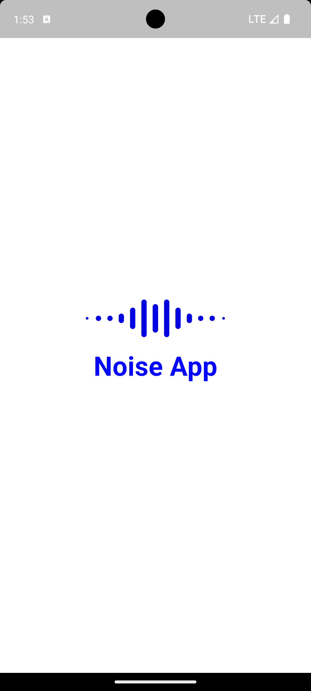 1&nbsp;&nbsp;&nbsp;  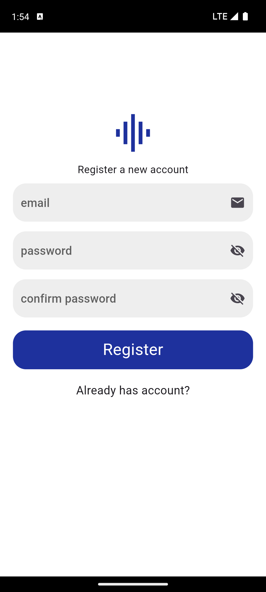 2&nbsp;&nbsp;&nbsp;  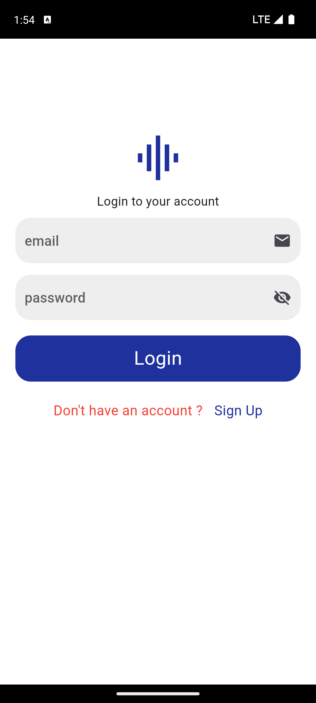3&nbsp;&nbsp;&nbsp;  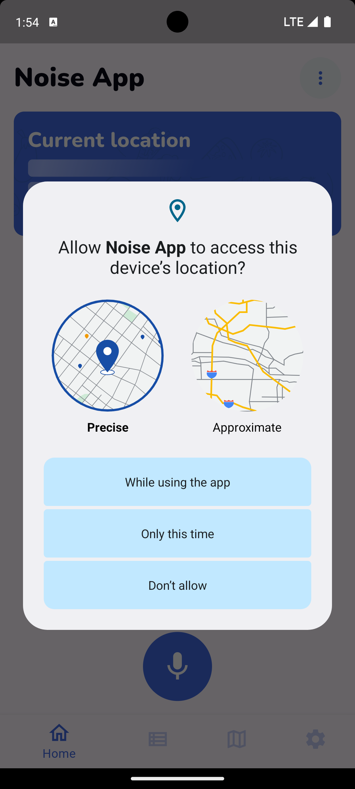

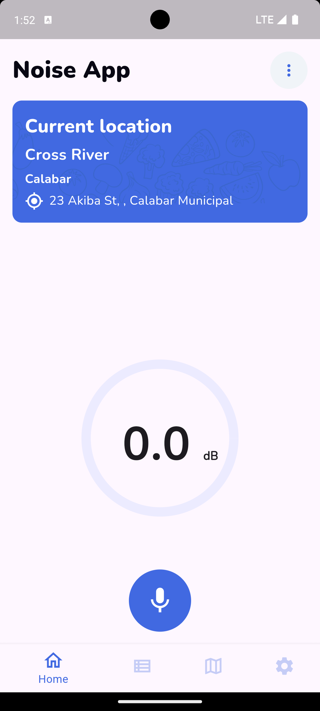 5&nbsp;&nbsp;&nbsp;  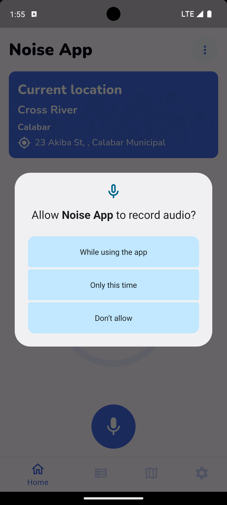 6&nbsp;&nbsp;&nbsp; 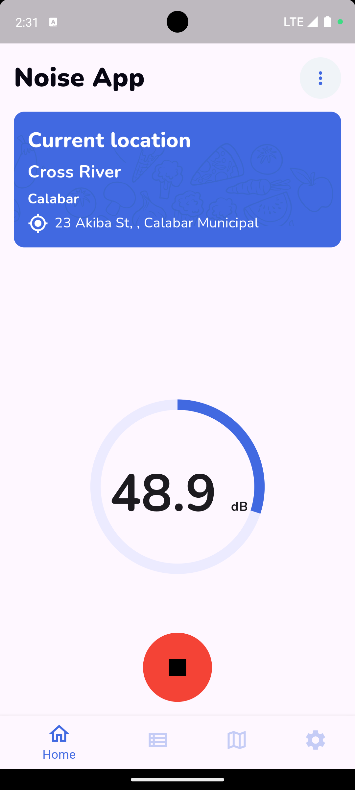7&nbsp;&nbsp;&nbsp;  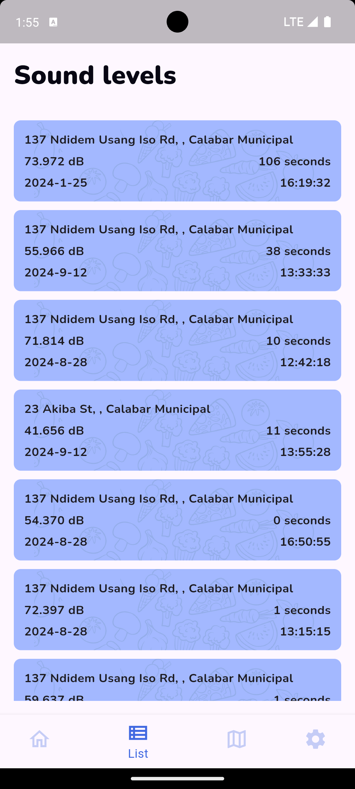

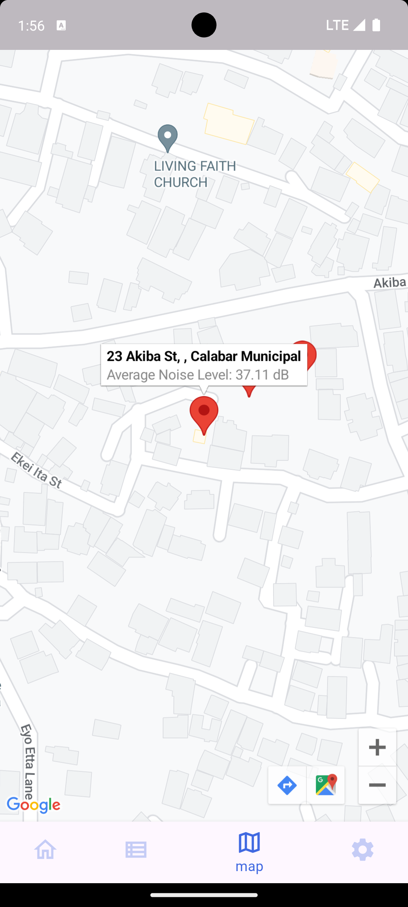 9&nbsp;&nbsp;&nbsp;  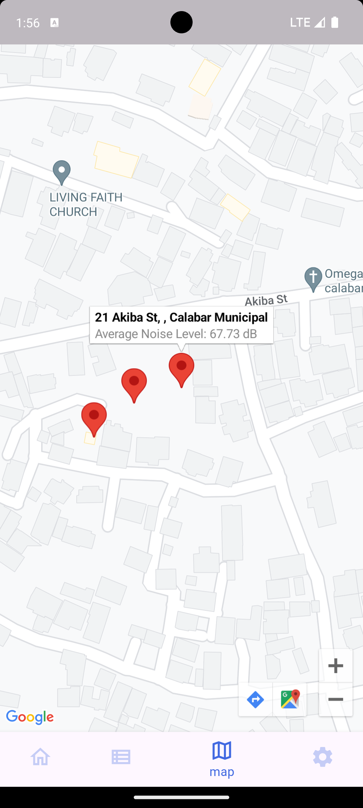 10&nbsp;&nbsp;&nbsp; 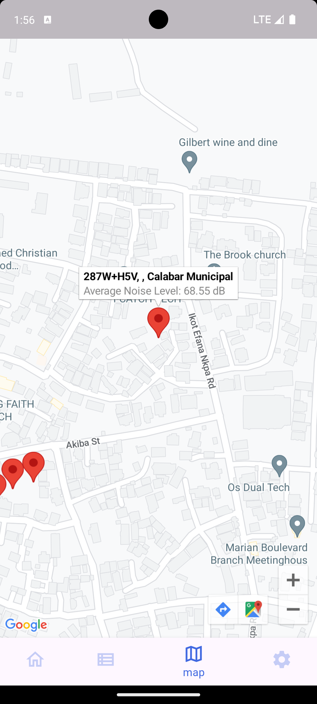11&nbsp;&nbsp;&nbsp;  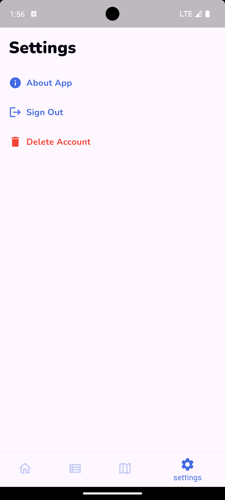

